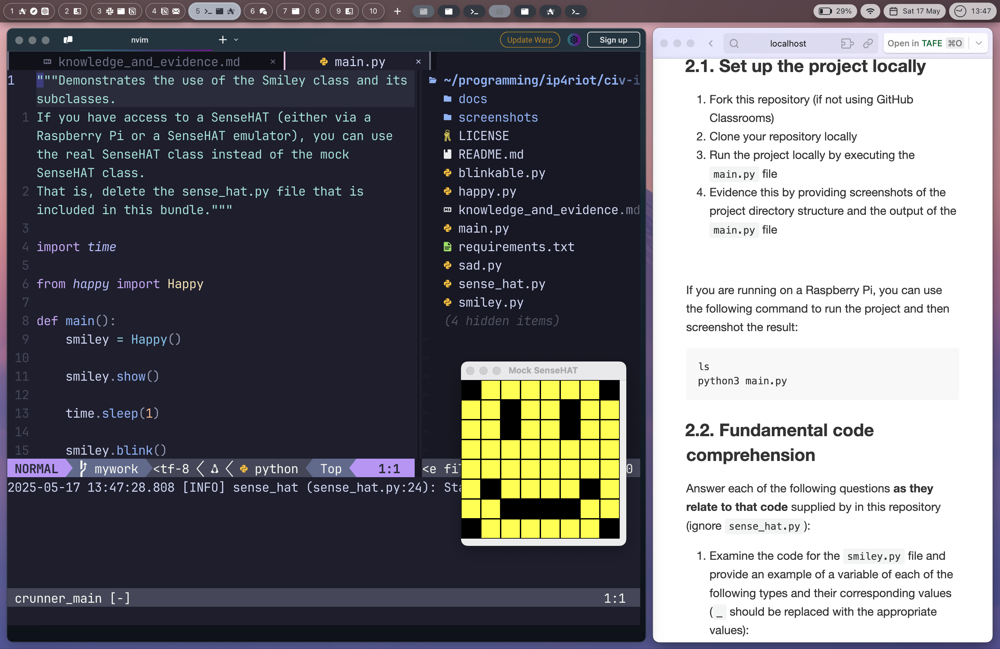
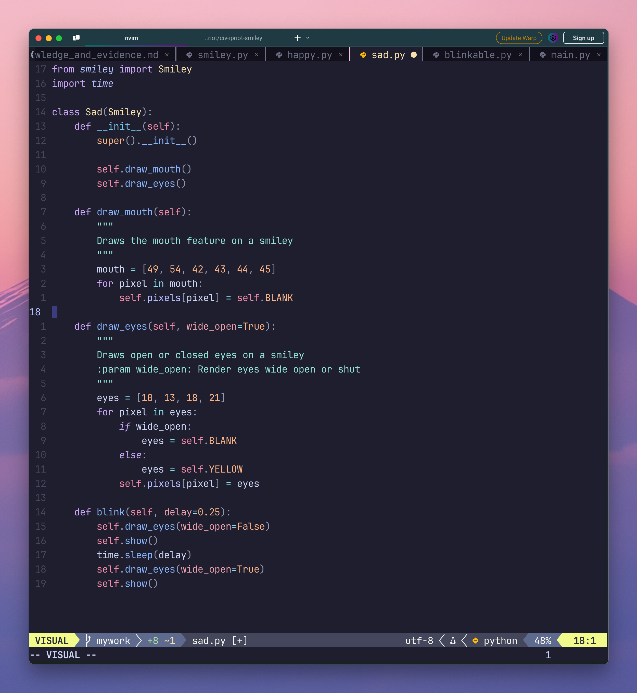

# Evidence and Knowledge

This document includes instructions and knowledge questions that must be completed to receive a *Competent* grade on this portfolio task.

## 1. Required evidence

### 1.1. Answer all questions in this document

- Each answer should be complete, well-articulated, and within the specified word count limits (if added) for each question.
- Please make sure **all** external sources are properly cited.
- You must **use your own words**. Please include your full chat transcripts if you use generative AI in any way.
- Generative AI hallucinates, is not an authoritative source

### 1.2. Make all the required modifications to the code

- Please follow the instructions in this document to make the changes needed to the code.

- When requested to upload evidence, upload all screenshots to `screenshots/` and embed them in this document. For example:

```markdown

```


> Note the `!`, and the use of a relative path.

- You must upload the code into your GitHub repository.
- While you can use a branch, your code should be in main when you submit.
- Upload a zip of this repository to Blackboard when you are ready to submit.
- You will be notified of your result via Blackboard
- However, if using GitHub classrooms, you may also receive additional feedback on GitHub directly

### 1.3. Optional: Use of Raspberry Pi and SenseHat

Raspberry Pi or SenseHat is **optional** for this activity. You can use the included `sense_hat.py` file to simulate the SenseHat on your computer.

If you use a Pi, please **delete** the `sense_hat.py` file.

### 1.4. Accessible version of the code

This project relies on visual patterns that appear on an LED matrix. If you have any accessibility requirements, you can use the `udl/accessible` branch to complete the project. This branch provides an accessible code version that uses text-based patterns instead of visual ones.

Please discuss this with your lecturer before using that branch.

## 2. Specific Tasks & Questions

Address the following tasks and questions based on the code provided in this repository.

### 2.1. Set up the project locally

1. Fork this repository (if not using GitHub Classrooms)
2. Clone your repository locally
3. Run the project locally by executing the `main.py` file
4. Evidence this by providing screenshots of the project directory structure and the output of the `main.py` file



If you are running on a Raspberry Pi, you can use the following command to run the project and then screenshot the result:

```bash
ls
python3 main.py
```

### 2.2. Fundamental code comprehension

 Answer each of the following questions **as they relate to that code** supplied by in this repository (ignore `sense_hat.py`):

1. Examine the code for the `smiley.py` file and provide  an example of a variable of each of the following types and their corresponding values (`_` should be replaced with the appropriate values):

   | Type                    | name       | value          |
   | ----------              | ---------- | -------------- |
   | built-in primitive type | dimmed          |  True             |
   | built-in composite type | WHITE          |  (255,255,255)             |
   | user-defined type(class etc)       | Smiley          | Lines 4-39              |

2. Fill in (`_`) the following table based on the code in `smiley.py`:

   | Object                   | Type                    |
   | ------------             | ----------------------- |
   | self.pixels              | Dictionary                       |
   | A member of self.pixels  | Tuple                       |
   | self                     | Class                       |

3. Examine the code for `smiley.py`, `sad.py`, and `happy.py`. Give an example of each of the following control structures using an example from **each** of these files. Include the first line and the line range:

   | Control Flow | File       | First line  | Line range  |
   | ------------ | ---------- | ----------- | ----------- |
   |  sequence    |  happy.py         |  import time |  1-5         |
   |  selection   | sad.py          | if wide_open:           | 26-29           |
   |  iteration   | sad.py          | for pixel in eyes:     | 25-30           |

4. Though everything in Python is an object, it is sometimes said to have four "primitive" types. Examining the three files `smiley.py`, `sad.py`, and `happy.py`, identify which of the following types are used in any of these files, and give an example of each (use an example from the code, if applicable, otherwise provide an example of your own):

   | Type                    | Used? | Example |
   | ----------------------- | ----- | --------|
   | int                     | Y     |  41, 46, 50, 51, 52, 53 (happy.py)  |
   | float                   | Y     | delay=0.25 (happy.py)          |
   | str                     | N     | "I used to be a cannon cleaner, until they fired me."          |
   | bool                    | Y     | dimmed=True (smiley.py)          |

5. Examining `smiley.py`, provide an example of a class variable and an instance variable (attribute). Explain **why** one is defined as a class variable and the other as an instance variable.

> `WHITE = ...` is an example of a **class variable**. This is because we want all instances to share the same colour set. 

>`self.pixels = ...` is an example of an **instance variable**. It references `self` which is a reference to the instance that is instantiated. This is because we want to individually manipulate the pixel set for each instance - otherwise all instances will display the same.


6. Examine `happy.py`, and identify the constructor (initializer) for the `Happy` class:
   1. What is the purpose of a constructor (in general) and this one (in particular)?

   > A constructor / initializer defines a 'standard' or set of attributes that is inherited when an instance is instantiated.

   > This particular initializer is used to inherit from it's super class, `Smiley`. It also immediately and automatically calls the methods defined in it's own class.

   2. What statement(s) does it execute (consider the `super` call), and what is the result?

   > It executes the initialiser from `Smiley` and executes method calls.
   > This results in `Happy` inheriting initializer attributes from `Smiley` (such as colours, pixels, etc.) while also immediately calling it's own set of methods that alter the inherited pixel set to make a :)

### 2.3. Code style

1. What code style is used in the code? Is it likely to be the same as the code style used in the SenseHat? Give to reasons as to why/why not:

> The code is using PEP8 as it's coding style/standard. It's likely that the SenseHat is using the same coding style. My main reason for believing so is in `smiley.py` in the `dim_display()` and `show_self()` functions; accessing methods from the imported SenseHat class, we can see the methods are using snake_case. Additionally, the import is from *sense_hat* (snake_case)

2. List three aspects of this convention you see applied in the code.

> 1. snake_case
> 2. `sad.py` line 28: line break after `else:`
> 3. Classes use PascalCase

3. Give two examples of organizational documentation in the code.

> sad.py `draw_mouth()` method docstring
> main.py docstring

### 2.4. Identifying and understanding classes

> Note: Ignore the `sense_hat.py` file when answering the questions below

1. List all the classes you identified in the project. Indicate which classes are base classes and which are subclasses. For subclasses, identify all direct base classes.
  
  Use the following table for your answers:

| Class Name | Super or Sub? | Direct parent(s) |
| ---------- | ------------- | ---------------- |
| Happy    | Sub           | Smiley, Blinkable    |
|   Sad      |   Sub         |      Smiley         |
|   Smiley      |   Super         |      Object         |
|   Blinkable      |   Super         |      ABC         |

2. Explain the concept of abstraction, giving an example from the project (note "implementing an ABC" is **not** in itself an example of abstraction). (Max 150 words)

> Abstraction is the process of hiding or *abstracting* the finer details and logic of a process and providing the user an interface to perform an action that doesn't require knowledge of how it works. 
> An example of this is the SenseHat(). We have a clearly defined interface for interacting with the SenseHat, without needing to know the fine details of how it works.

3. What is the name of the process of deriving from base classes? What is its purpose in this project? (Max 150 words)

> This is called inheritance. This is used extensively in this project for providing each 'emotion' or 'face' the pixel set, the colours, encapsulating the SenseHat object, and actually setting the pixels on the SenseHat (+ more). Without this inheritance, the other classes methods simply won't work. 
>

### 2.5. Compare and contrast classes

Compare and contrast the classes Happy and Sad.

1. What is the key difference between the two classes?
   > Besides the obvious difference of pixel set changes.
   > The main difference is that Happy is blinkable, therefore it must define a `blink()` method, which it has done. 
2. What are the key similarities?
   > Both have `draw_eyes()` and `draw_mouth()`, and both inherit from `Smiley`
   >
3. What difference stands out the most to you and why?
   > Only Happy blinks! Sad people blink too!
   
   > Also, side note: Sad `draw_mouth()` docstring doesn't explain how it draws the mouth, Happy does. I don't think there should be a change in information for effectively the same method.

4. How does this difference affect the functionality of these classes
   > Happy now *must* blink - it now has no choice, since it has inherited a base method. 

1. Which class(es) utilize the functionality of the SenseHat?
   > Smiley, Happy, Sad - currently, Sad technically is not *utilising* the functionality, but it definitely can. Happy, on the other hand, is using it's inherited methods to `.show()`.
   >
2. Which of these classes directly interact with the SenseHat functionalities?
   > Currently, Happy. I think this is a trick question and expects the answer Smiley, but from my understanding it is actually Happy in main.py. Since the methods that interact with Sensehat are *inherited* from Smiley, not just borrowing. 
   >
3. Discuss the hiding of the SenseHAT in terms of encapsulation (100-200 Words)
   > The SenseHat is contained in a seperate file, and only the necessary aspects for the project are accessed in our project files. This protects the integrity of the SenseHat program, and ensures no values are accidentally changed and no functions/methods are accidentally (or purposefully) called. The internal state is not exposed for misuse, and the necessary details are presented in a well-defined interface such as `show()` and `dim_display()` that implicitely define access rules. We simply do not need all the inner workings of the SenseHat to complete the tasks necessary for our project, so we hide them to prevent modification. This also bleeds into abstraction.  
   >

### 2.7. Sad Smileys Can’t Blink (Or Can They?)

Unlike the `Happy` smiley, the current implementation of the `Sad` smiley does not possess the ability to blink. Let's first explore how blinking has been implemented in the Happy Smiley by examining the blink() method, which takes one argument that determines the duration of the blink.

**Understanding Blink Mechanism:**

1. Does the code's author believe that every `Smiley` should be able to blink? Explain.

> The code has been written to suggest Yes. If he did not believe so, he would not have written an abstract class - he would have simply written the method into Happy and be done with it. Abstracting this ability into an ABC implies that there are other smileys that should or will be able to blink. 
>

2. For those smileys that blink, does the author expect them to blink in the same way? Explain.

> No - he has provided a delay param that directs how long the blink duration is. Interestingly, this is not something required by the ABC but coded into the Happy class itself. The author, based on his code, has clearly not been happy before, since no happy person blinks like that. I am simply making an observation, and not a judgement on his character (maybe)
>

3. Referring to the implementation of blink in the Happy and Sad Smiley classes, give a brief explanation of what polymorphism is.

> Polymorphism is performing the same action/process in different ways. In the case of blinking, the Blinkable class defines the need to blink(), but does not specify *how*. This is polymorphism being setup, as it leaves it up to the subclasses to determine this, on a per-subclass basis, as Happy has done.
>

4. How is inheritance used in the blink method, and why is it important for polymorphism?

> Happy's blink() utilises the inherited method `show()` - inherited from Smiley. It's important for polymorphism as it allows multiple ways to affect the same thing - in this case, it allows for multiple ways to program the blink() function (polymorphism) while still allowing it to provide the same end result (inheritance)
>
1. **Implement Blink in Sad Class:**

   - Create a new method called `blink` within the Sad class. Ensure you use the same method signature as in the Happy class:

   ```python
    def blink(self, delay=0.25):
        self.draw_eyes(wide_open=False)
        self.show()
        time.sleep(delay)
        self.draw_eyes(wide_open=True)
        self.show()
   ```

2. **Code Implementation:** Implement the code that allows the Sad smiley to blink. Use the implementation from the Happy Smiley as a reference. Ensure your new method functions similarly by controlling the blink duration through the `delay` argument.

3. **Testing the Implementation:**

- Test the new blink functionality on your Raspberry Pi or within the Python classes provided. You might need to adjust the `main.py` script to incorporate Sad Smiley's new blinking capability.

Include a screenshot of the sad smiley or the modified `main.py`:



- Observe and document the Sad smiley as it blinks its eyes. Describe any adjustments or issues encountered during implementation.

  > The Sad smiley blinks just as the Happy smiley does. I did have to import time, and adjust main.py to import and instantiate a Sad smiley instead of Happy.

  ### 2.8. If It Walks Like a Duck…

  Previously, you implemented the blink functionality for the Sad smiley without utilizing the class `Blinkable`. Assuming you did not use `Blinkable` (even if you actually did), consider how the Sad smiley could blink similarly to the Happy smiley without this specific class.

  1. **Class Type Analysis:** What kind of class is `Blinkable`? Inspect its superclass for clues about its classification.

     > `Blinkable` is an Abstract Base Class.

  2. **Class Implementation:** `Blinkable` is a class intended to be implemented by other classes. What generic term describes this kind of class, which is designed for implementation by others? **Clue**: Notice the lack of any concrete implementation and the naming convention.

  > Abstract class.

  3. **OO Principle Identification:** Regarding your answer to question (2), which Object-Oriented (OO) principle does this represent? Choose from the following and justify your answer in 1-2 sentences: Abstraction, Polymorphism, Inheritance, Encapsulation.

  > Polymorphism. It determines *specific* methods that must be created with each sub-classes own implementation. It forces the same idea upon it's subs, yet implemented in different ways. 

  4. **Implementation Flexibility:** Explain why you could grant the Sad Smiley a blinking feature similar to the Happy Smiley's implementation, even without directly using `Blinkable`.

  > 1. None of these used methods were unique to the blinkable class. 2. You can still *create* these methods, you just don't *have* to.

  5. **Concept and Language Specificity:** In relation to your response to question (4), what is this capability known as, and why is it feasible in Python and many other dynamically typed languages but not in most statically typed programming languages like C#? **Clue** This concept is hinted at in the title of this section.

  > This capability is known as duck typing. It's not possible in most statically typed languages as they rely on the declared type to determine if a method is able to be called or not. In Python, this is not the case - you don't have to declare types explicitly. It will allow you to call blink() so long as it exists in the class. Essentially, most STL's require you to explicitly define where blink comes from - Python does not.

  ***

  ## 3. Refactoring

  ### 3.1. Does a Smiley Have to Be Yellow?

  While our current implementation predominantly features yellow smileys, emotional expressions like sickness or anger typically utilize colors like green, red, or orange. We'll explore the feasibility of integrating these colors into our smileys.

  1. **Defined Colors and Their Location:**

     1. Which colors are defined and in which class(s)?
        > Smiley defines these colours. Happy and Sad inherit them.
     2. What type of variables hold these colors? Are the values expected to change during the program's execution? Explain your answer.
        > A tuple holds these RGB values. They are not expected to change - we know this due to PEP8 naming conventions that say when a class is in ALLCAPS, it should not be changed.
     3. Add the color blue to the appropriate class using the appropriate format and values.

  2. **Usage of Color Variables:**

     1. In which classes are the color variables used?
        > Happy and Sad.

  3. **Simple Method to Change Colors:**
  4. What is the easiest way you can think to change the smileys to green? Easiest, not necessarily the best!
     > `Y = self.GREEN`

  Here's a revised version of the "Flexible Colors – Step 1" section for the smiley project, incorporating your specifications for formatting and content updates:

  ### 3.2. Flexible Colors – Step 1

  Changing the color of the smileys once is straightforward, but it isn't very flexible. To facilitate various colors for smileys, it is advisable not to hardcode values in any class. This approach was identified earlier as a necessary change. Let's start by removing the built-in assumptions about color in our classes.

  1. **Add a method called `complexion` to the `Smiley` class:** Implement this instance method to return `self.YELLOW`. Using the term "complexion" instead of "color" provides a more abstract terminology that focuses on the meaning rather than implementation.

  2. **Refactor subclasses to use the `complexion` method:** Modify any subclass that directly accesses the color variable to instead utilize the new `complexion` method. This ensures that color handling is centralized and can be easily modified in the future.

  3. **Determine the applicable Object-Oriented principle:** Consider whether Abstraction, Polymorphism, Inheritance, or Encapsulation best applies to the modifications made in this step.

  4. **Verify the implementation:** Ensure that the modifications function as expected. The smileys should still display in yellow, confirming that the new method correctly replaces the direct color references.

  This step is crucial for setting up a more flexible system for color management in the smiley display logic, allowing for easy adjustments and extensions in the future.

  ### 3.3. Flexible Colors – Step 2

  Having removed the hardcoded color values, we now enhance the base class to support dynamic color assignments more effectively.

  1. **Modify the `__init__()` method in the `Smiley` class:** Introduce a default argument named `complexion` and assign `YELLOW` as its default value. This allows the instantiation of smileys with customizable colors.

  2. **Introduce a new instance variable:** Create a variable called `my_complexion` and assign the `complexion` parameter to it. This step ensures that each smiley instance can maintain its own color state.

  3. **Rationale for `my_complexion`:** Using a distinct instance variable like `my_complexion` avoids potential conflicts with the method parameter names and clarifies that it is an attribute specific to the object.

  4. **Bulk rename:** We want to update our grid to use the value of complexion, but we have so many `Y`'s in the grid. Use your IDE's refactoring tool to rename all instances of the **symbol** `Y` to `X`. Where `X` is the value of the `complexion` variable. Include a screenshot evidencing you have found the correct refactor tool and the changes made.

  

  5. **Update the `complexion` method:** Adjust this method to return `self.my_complexion`, ensuring that whatever color is assigned during instantiation is what the smiley displays.

  6. **Verification:** Run the updated code to confirm that Smileys still defaults to yellow unless specified otherwise.

  ### 3.4. Flexible Colors – Step 3

  With the foundational changes in place, it's now possible to implement varied smiley colors for different emotional expressions.

  1. **Adjust the `Sad` class initialization:** In the `Sad` class's initializer method, change the superclass call to include the `complexion` argument with the value `self.BLUE`, as shown:

     ```python
     super().__init__(complexion=self.BLUE)
     ```

  2. **Test color functionality for the Sad smiley:** Execute the program to verify that the Sad smiley now appears blue.

  3. **Ensure the Happy smiley remains yellow:** Confirm that changes to the Sad smiley do not affect the default color of the Happy smiley, which should still display in yellow.

  4. **Design and Implement An Angry Smiley:** Create an Angry smiley class that inherits from the `Smiley` class. Set the color of the Angry smiley to red by passing `self.RED` as the `complexion` argument in the superclass call.

  ***
